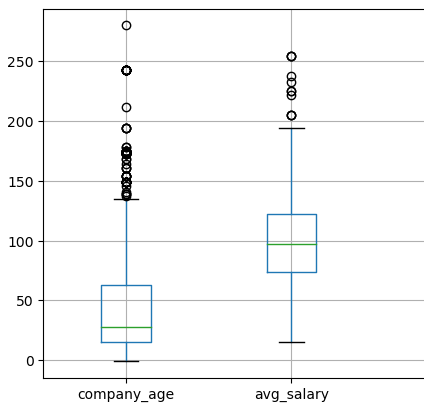

# Estimator for Data Science role salaries

_Based on glassdoor data_

### Overview

- This tool helps estimate salaries for helping data science professionals to negotatiate during job interviews
- Used scraped data from glassdoor (need to write the scraping script for this to get it up to date)
- extracted features from the job description to cover relevant skills in the model
- Optimized various regression and ensemble models using GridSearchCV to tune hyperparameters in the model
- Built a simle Flask API endpoint for using the app

### Code and Resources Used

- **Data Source**: [Kaggle](https://www.kaggle.com/datasets/prithviraj7387/datascientistsalaries/code)
- **Python Version**: 3.8.19
- **Packages Used**: pandas, numpy, matplotlib, sklearn, matplotlib, seaborn, flask, json, pickle
- **For web framework requirements**: pip install -r requirements.txt
- **Scraper Github**: https://github.com/arapfaik/scraping-glassdoor-selenium
  (note this needs to be updated for scraping data)

### Project Details

#### 1. Web Scraping

- Scraping is buggy in the current build. So scraped data has been used for progressing. Scraper needs to be rebuilt for streaming data into the model.

#### 2. Data Cleaning

- parsed numeric data out of the salary estimates (string)
- added features for employer provided salaries and hourly salaries
- parsed company name, state and city to separate them as features
- added feature for determining if job location is same as company headquarters
- added company age feature
- parsed Job description for relevant technicals skill such as
  - Python
  - Spark
  - Cloud (AWS/Azure/GCP)
  - BigData
  - Deployments (Kubernetes/Docker)
  - Data Visualization (Tableau/PowerBI/Looker)
  - Web Development (Flask/javascript etc)
- added columns to simplify job titles and seniority
- added column for job description length

#### 3. Exploratory Data Analysis

- Explored various variables for job counts and avg salaries to understand trends in the data. Below are a few hilights:
- TODO: Can build out a tableau dashboard to display the same trends in one view

#### 4. Model Building

- Categorical variables were encoded using dummy variables and data was split into training (80%) and test(20%) modules
- MAE was chosen for evaluating and comparing the models since it works well in these kind of scenarios and is easy to interpret without having excessive outliers.
  1. **Multiple Linear Regression** model was used as a baseline and was then improved upon further
  2. **Lasso Regression** was used to further reduce the absolute error since the data has large number of categorical variables, a normalized regression model's effectivenes was checked.
  3. **Random Forest** model was tested as this ensemble method works well with sparse data having large no of categorical variables

#### 5. Model Evaluation

The Random Forest model outperformed the Multiple Linear Regression and Lasso Regression models by huge margin. Mean Absolute Errors for the test/validation sets were as follows: (unit for following numbers is - thousands of Dollars)

1. **Multiple Linear Regression**: 22.45
2. **Lasso Regression**: 20.09
3. **Random Forest**: 11.12

#### 6. Model Productionization

A simple flask API endpoint was built after pickling the model and exporting it. The API endpoint was hosted on a local webserver. The API takes in a request with a dummified list of values from a Job posting and returns an estimated salary.
